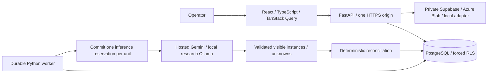

# Architecture

Bounded catalogue, open box, exposed items. The target is merchant-fulfilled sellers and 3PLs, not fully FBA sellers. Hidden contents and arbitrary merchandise recognition are outside the supported claim.

The participant replaced the initial controller design with a conservative one-call workflow. No LangGraph or model-selected tools are used. Catalogue lookup, comparison, explanations and storage are ordinary code. Durable snapshots are application workflow state, not LangGraph checkpoints.

Snapshot order/catalogue → validate/save photo → enqueue → lease job → commit unit call reservation → single batched inference → validate observations → compare → save result/events. No expected order quantities enter the visual prompt. Catalogue alternatives are allowed; reference images are explicitly not counting evidence. No bounding boxes are invented. Unknown identity and exact count are explicit. Missing quantities require sufficient coverage; proven extras/over-counts take precedence over other uncertainty.

Every business table has ENABLE and FORCE ROW LEVEL SECURITY using transaction-local app.organization_id. API/worker run as pack_app, NOSUPERUSER/NOBYPASSRLS. Records stores versioned products/orders/images/attempts/reservations; jobs stores leases/idempotency; events stores timeline entries; checkpoints stores final/pending workflow snapshots. Alembic's administrative version table is not tenant data and is not granted to pack_app.

The implemented hosted authentication adapter verifies Supabase access tokens through its Auth service. Administrator-controlled app_metadata must assign the configured organization and an operator/supervisor role; user_metadata is ignored. The optional legacy Entra adapter validates JWT signature, audience, issuer, expiry, tenant and application roles. Organization and supervisor identity do not come from arbitrary headers. Local mode is development-only. Image metadata must authorize access before reading a server-generated private storage key.

Order/catalogue snapshots stay attached to an attempt. A retake supersedes the old attempt and clears physical observations. Supervisor review appends identity, time, reason and old/new outcomes separately. Stale review versions and superseded attempts are rejected. Export hashing excludes overrides and supersession and does not claim tamper-proof storage.

Submission uses request-body hash + idempotency key. SKIP LOCKED and a lease of at least 120 seconds, extended to exceed the configured model timeout by 60 seconds, claim work; lease owner fences final publication. Before inference, a unique organization/unit reservation commits. Recovery never repeats a reserved call, even if a crash occurred before transmission. This trades automatic recovery for conservative rule compliance. Default provider timeout is 45 seconds, SDK retries zero, completion budget 4,000 tokens, worker concurrency one. If final persistence fails, success is not reported.

Legacy unused Azure templates describe ACR, private Blob objects, PostgreSQL Flexible Server on a delegated subnet/private DNS, Container Apps web/worker, separate migration job/identity, Key Vault, logs and budget alerts. App identity cannot read migration credentials. Hosted model inference needs no GPU container. Readiness checks database/schema/role without inference; liveness does not depend on provider availability. Worker minimum replica is one because polling cannot wake a zero-replica worker.

The model's identity/coverage judgment is not calibrated proof. Real reliability requires held-out measurement. Optional demo sessions use signed HttpOnly/SameSite cookies and distinct organizations; PostgreSQL limits sessions, submissions and images, while the worker purges expired demo data. Local tests verify isolation and expiry; cloud verification remains pending. Orders/history paginate in 50-row pages; catalogue archival and packed acknowledgement preserve prior evidence. No physical equipment is controlled. Cloud templates compile but have not been deployed.

The current deployment target is a free Render web service, Supabase database/private storage/Auth, and a laptop worker with a local Ollama vision model. The laptop must stay on for inference; the model endpoint is loopback-only. No paid worker or external model API is required by this architecture. Hosted integration is not yet verified.

The public landing page is at `/`; the authenticated application is at `/workspace`. Render/Supabase preparation is documented in `docs/DEPLOYMENT_RENDER.md`. The free hosting profile disables automatic inference with `WORKER_ENABLED=false`; it does not silently queue work without a deployed worker. The required Pack registry and partial Evidence Contract 1.1 migration are documented in `docs/SUPPLIED_DATA_REVIEW.md`. Legacy workspace exports remain provisional.

## Post-competition deployment boundary

The existing same-origin frontend/API remains the preferred compatible preview deployment; no Vercel frontend or public API is currently verified. `backend.service` starts separate API/worker processes in one Render service, and stops the service if either exits unexpectedly. Processing state is **never** an in-memory background-task list: PostgreSQL jobs, leases and committed unit reservations remain authoritative. Sleeping/restarting Render can interrupt an inference; its already-reserved unit is never called again and becomes pending on recovery. This trades availability for the conservative one-call rule. Free hosting is not an always-on warehouse service.

The optional Gemini adapter has no tools, retries, alternate provider or JSON repair. It uses a fixed reviewed endpoint/model, up to four separately labelled reference images, one final primary counting photograph, bounded output, and strict local validation. Expected quantities never enter its request. Billing-disabled Free tier must be confirmed outside the app; a configuration flag does not enforce external billing. Quota/provider errors become pending. Hosted identification is still unvalidated and requires human review by default. No free-tier model request has yet been run on a real image.

Local Qwen3-VL uses the same primary/reference distinction but still failed the new four-product experiment. A model's `source_image=primary` assertion is only a claim, not proof of correct grounding. Invalid/truncated local or Gemini answer text is retained as a tenant-scoped `provider_diagnostic` record, excluded from public logs and official checks. No thinking trace is stored by this diagnostic path. The original seven research artifacts remain untouched.

The camera component requests a rear-facing stream only after an operator action, shows framing guidance and a close control while waiting, captures one primary image, and stops tracks when closed/unmounted. It has file-upload fallback. This does not yet implement the contract's full two-to-three-view capture/direct-upload lifecycle; extra views must never have their item counts summed.

Post-competition changes belong to `post-competition/completion-audit`. Preserve `main` at original snapshot `1e503a0`; do not imply deadline eligibility without documented organiser clarification.
