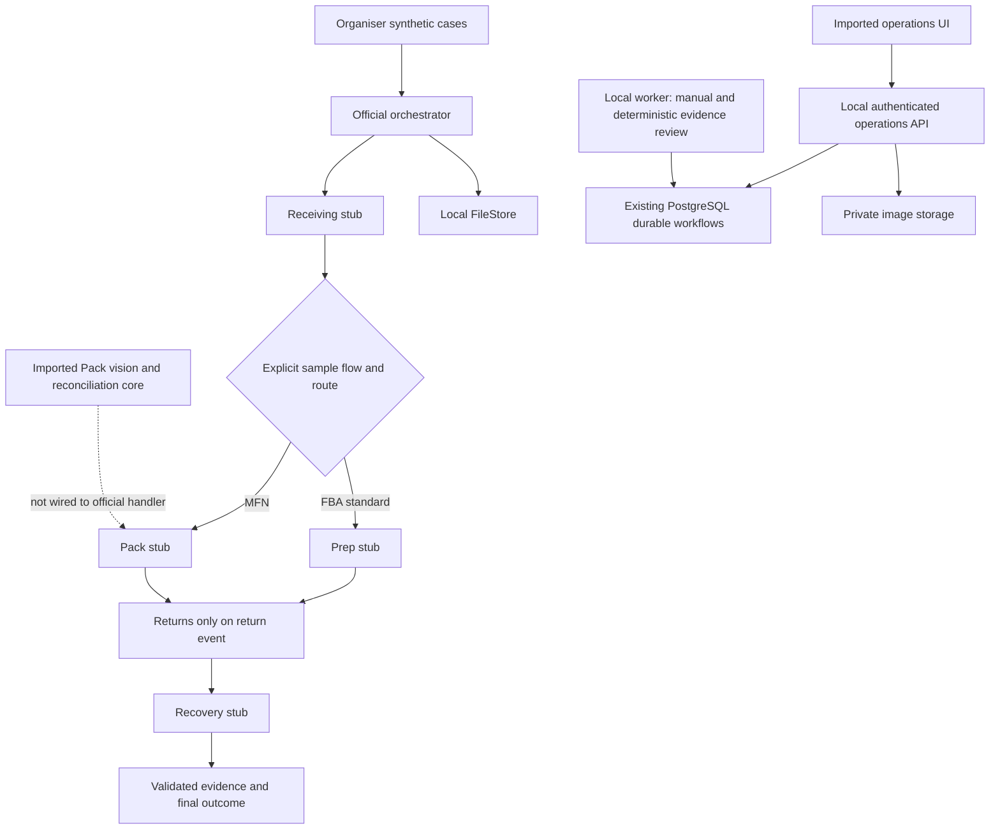
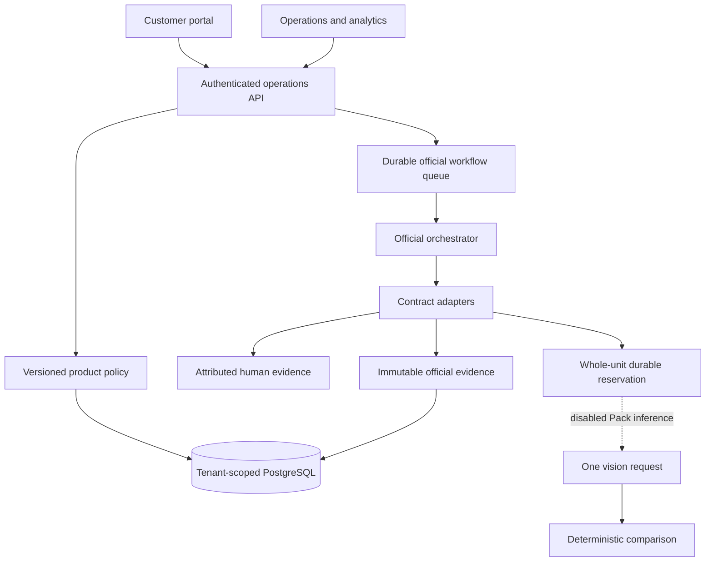

# Architecture and integration boundary

Pack's visual path now separates tenant-private raw provider records (`pod_model_response`), schema-validated observations, deduplication decisions, deterministic quantity comparison and human reviews. Optional model regions are bounds-validated and tied to the saved primary-image hash; references cannot be count sources. Exact SKU/variant aggregation follows conservative overlap handling (IoU >= 0.85 always forces review). The operations workflow includes an official visual-evidence viewer; full official nonvisual evidence controls remain incomplete. See [visual implementation](docs/VISUAL_INSPECTION.md). No new database migration or model dependency; no live calls were made.

## Bounded teammate integration

Existing supervisor review -> saved source payload and authorized image hashes -> official Pod human adapter -> optional deterministic Receiving/Prep checks -> validated immutable evidence -> orchestrator-derived outcome. Receiving uses `source_payload.receiving_observations`; Prep uses `source_payload.prep_capture`. Strict inputs, missing-as-unknown handling and source review/run/version retention preserve attribution. The optional checks always request human review and make no model calls. Existing routing, PostgreSQL, authentication, private images and call reservations are reused; no standalone teammate app or provider client is mounted. See [audit](docs/TEAM_AGENT_COMPARISON.md).

The application now bridges official orchestration through `backend/pod/`. The original CLI remains a separate sample-stub path. The following diagram documents that original boundary; the current bridge and commerce additions are described below.

The official orchestrator owns routing, transitions, retries and final outcomes. Schema 1.0 in `shared/schemas/` is authoritative. Its stage state enum has no running value: an active stage is derived from workflow `IN_PROGRESS`, `current_stage`, a start time and no finish time. State is now saved before dispatch for accurate readers. The imported UI instead reads its legacy API's persisted `run.state`; no timer invents progress. The current bridge is described below; the UI continues to use the operational read model.

The official API has no production authentication and must remain loopback-only. FileStore is a local sample store, not the tenant-safe production database. The imported platform has organisation checks, PostgreSQL workflow state and protected image access; those protections must be retained when adapting official envelopes. Do not expose the starter API to bypass them.

Pack core separates primary scene evidence from identity-only catalogue references, then uses deterministic code for quantities and decisions. Importing this code does not establish identification accuracy. No live call was made in this continuation. The shared durable reservation now covers application dispatch paths; changing a request ID never resets it. Provider errors and invalid output must remain pending/error and cannot permit PASS.

The Pod assignment is unresolved in `pod-assignment.json`; `pod.json` is unchanged template content. Standard and Specialist fixture runs only exercise code paths. Current scope is local-only. Out-of-pocket limit: ₹0.

## Current application bridge and commerce data flow

Migration 003 stores official workflows/evidence/cached outputs. Migration 004 stores commerce inventory/orders/returns/events/policies while reusing catalogue and cw_* workflows. One database serves all managers. Orders lock inventory and reserve stock transactionally; returns lock purchases and enforce cumulative quantities. Identity-scoped idempotency binds payloads. Customer projections exclude internal evidence. Role checks and RLS enforce customer/tenant isolation.

Policies preserve version, source, selected rules, checks and skipped reasons. Checkout references inbound receipts without scheduling Receiving. Unknown policy/assignment holds work. Prep and Pack are alternatives; Returns needs an event; Recovery needs a charge event and admissible evidence. This Recovery predicate differs from the original sample flow and needs team review. Version-checked policy review cannot bypass assignment holds.

The Pod Store adapter validates official schemas, fences leases and persists state versions. Possibly dispatched expired work fails for review rather than automatic redispatch. The reservation key is shared across legacy and Pod paths and retains original physical unit identity for returns. There are no model retries or repair calls. Experimental matching Pack evidence still requires human review. Actual visual recognition remains unverified.

The operational tracker polls persisted cw_* states and timestamps with reduced-motion support. Official records are exposed through /v1/pod APIs; a complete official-evidence UI remains unfinished. Analytics uses persisted tenant-scoped cohorts, excludes fixtures by default and does not infer unsupported dispositions or missing durations. See [local runbook](docs/LOCAL_COMMERCE.md) for setup, API and remaining limitations.
