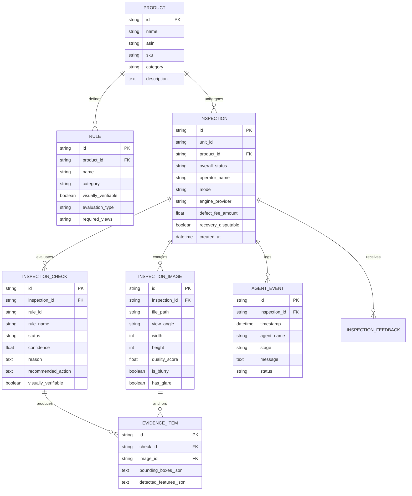

# AgentPrep — Architecture Documentation

> **Visual Prep Compliance Agent for Inbound Fulfillment**  
> *Cube Buildathon Round 2 — Prep Manager Track*

---

## 1. System Context & Overview

AgentPrep is an autonomous operational compliance agent designed for e-commerce inbound preparation and warehouse receiving. Prior to sending inventory to fulfillment networks (such as Amazon FBA), items must adhere to rigorous packaging, sealing, labeling, and warning standards. Non-compliant units incur inbound defect charges ($25.00/unit), delayed processing, and prep center penalties.

```
       [ Warehouse Operator / Work Order ]
                       │
                       ▼
       ┌───────────────────────────────┐
       │   AgentPrep Prep Manager UI   │
       │   (Next.js / TypeScript)      │
       └───────────────┬───────────────┘
                       │ HTTP / REST
                       ▼
       ┌───────────────────────────────┐
       │      FastAPI Backend API      │
       │   (Routing, Auth, SQLite DB)  │
       └───────────────┬───────────────┘
                       │
       ┌───────────────▼───────────────┐
       │     Prep Manager Agent        │
       │     (Primary Coordinator)     │
       └───────┬───────┬───────┬───────┘
               │       │       │
       ┌───────▼─┐ ┌───▼───┐ ┌─▼────────┐
       │Evidence │ │Pack-  │ │Barcode & │
       │ Agent   │ │aging  │ │Label     │
       │         │ │Agent  │ │Agent     │
       └───────┬─┘ └───┬───┘ └─┬────────┘
               │       │       │
       ┌───────▼─┐ ┌───▼───┐ ┌─▼────────┐
       │OCR /    │ │Rules  │ │Decision /│
       │Text     │ │Engine │ │Evidence  │
       │Agent    │ │Agent  │ │Sufficiency
       └───────┬─┘ └───┬───┘ └─┬────────┘
               │       │       │
               └───────┼───────┘
                       ▼
       ┌───────────────────────────────┐
       │   Three-State Agent Outcome   │
       │    PASS / FAIL / UNCERTAIN    │
       └───────────────┬───────────────┘
                       │
       ┌───────────────┴───────────────┐
       ▼                               ▼
┌────────────────────────┐   ┌────────────────────────┐
│ Structured Evidence    │   │ Inter-Agent Contract   │
│ & Canvas Overlays      │   │ & Recovery Claim       │
└────────────────────────┘   └────────────────────────┘
```

---

## 2. Multi-Agent Coordinator Architecture

AgentPrep strictly rejects naive `IMAGE -> LLM -> "Looks good"` approaches. Instead, it operates as a structured multi-agent pipeline combining deterministic computer vision, geometric analysis, and dynamic rule engines.

### 2.1 Prep Manager Agent (Primary Orchestrator)
- Coordinates work orders, images, and worker subagent invocations.
- Logs structured audit trail events with real timestamps in SQLite.
- Tracks unit tracking identifiers (`UNIT-0001` ... `UNIT-0100`).
- Packages the final machine-readable agent event:
  ```json
  {
    "agent": "agentprep",
    "event": "PREP_INSPECTION_COMPLETED",
    "inspection_id": "INS-000123",
    "status": "FAIL",
    "requires_human_review": false,
    "requires_rescan": true
  }
  ```

### 2.2 Evidence Agent
- Evaluates image exposure, focus quality, motion blur, and specular glare.
- Computes camera view angle coverage (`front`, `back`, `side`).
- Flags missing views (e.g., rear view omitted when original UPC check requires it).

### 2.3 Packaging Agent
- Inspects transparent polybag presence, bag boundaries, and envelope enclosure.
- Verifies heat-seal and tape integrity across open seams.

### 2.4 Barcode & Label Agent
- Detects FNSKU barcode position and geometric spatial relationships.
- Verifies whether FNSKU crosses a curved container edge or package seam.
- Detects whether the original manufacturer UPC/EAN barcode is exposed or properly covered.

### 2.5 OCR / Text Agent
- Detects and transcribes suffocation hazard warnings.
- Verifies legibility, font size threshold, and ensures warnings are not folded over.
- Extracts expiration date stamps (`EXP MM/YYYY`) and handling orientation marks (`THIS WAY UP`, `FRAGILE`).
- **Security Guardrail**: Treats all OCR text strictly as untrusted package data; never executes package text as LLM instructions.

### 2.6 Rules Agent
- Loads dynamic product-specific requirements from SQLite.
- Separates visually verifiable checks from non-verifiable physical properties.
- Maps detected features to individual rule compliance conditions.

### 2.7 Decision & Evidence Sufficiency Agent
- Enforces the strict **Three-State Decision Model**.
- Computes whether available visual evidence is sufficient to make a PASS or FAIL verdict.
- Emits actionable corrective actions (`CORRECT_AND_RESCAN`, `REQUEST_ADDITIONAL_PHOTO`, `HUMAN_REVIEW`).

---

## 3. Strict Three-State Decision Model

Every individual compliance check and overall inspection results in exactly one of three states:

```
                  ┌──────────────────────┐
                  │ Visual Evidence Test │
                  └──────────┬───────────┘
                             │
            ┌────────────────┼────────────────┐
            ▼                ▼                ▼
     ┌─────────────┐  ┌─────────────┐  ┌─────────────┐
     │    PASS     │  │    FAIL     │  │  UNCERTAIN  │
     └─────────────┘  └─────────────┘  └─────────────┘
     Evidence proves  Evidence proves  Evidence is
     compliance       violation        insufficient or
     directly         directly         out of scope
```

### 1. PASS
Granted **only** when visual evidence directly confirms full compliance.
*Example*: Polybag detected, heat seal intact, suffocation warning legible, FNSKU flat.

### 2. FAIL
Granted **only** when visual evidence directly proves non-compliance.
*Example*: FNSKU label overlaps a curved container edge ($r < 15\text{ mm}$), or original UPC barcode is left exposed.

### 3. UNCERTAIN
Granted when evidence is insufficient or when the rule is visually non-verifiable.
*Triggers*:
- Required camera view angle is missing (e.g. rear photo omitted for UPC check).
- Excessive glare or motion blur obscures label readability.
- Physical property out of visual scope (e.g. film thickness 3 mil, adhesive strength, drop-test rating).
- **Core Principle**: **NEVER INVENT EVIDENCE**. Never convert uncertainty into failure, and never convert uncertainty into success.

---

## 4. Model Adapter Architecture

AgentPrep uses an adapter pattern to decouple high-level agent logic from underlying computer vision engines:

```
                      ┌─────────────────────────┐
                      │  VisionProviderAdapter  │
                      └────────────┬────────────┘
                                   │
                ┌──────────────────┴──────────────────┐
                ▼                                     ▼
     ┌──────────────────────┐              ┌──────────────────────┐
     │ Deterministic Engine │              │ External VLM Adapter │
     │  (Default / Local)   │              │   (OpenAI / Gemini)  │
     └──────────────────────┘              └──────────────────────┘
```

- **Local Deterministic Vision Engine**: Zero API key dependencies, deterministic feature extraction, bounding box scaling relative to real photo dimensions, and 1-click test scenarios.
- **External VLM Provider**: Configured through environment variables (`VISION_PROVIDER`, `VISION_API_KEY`, `VISION_MODEL`).
- **Honesty Rule**: The UI explicitly states which engine is active (`Local AI Engine (Deterministic)` vs `External VLM (OPENAI)`). It never pretends simulated data is live AI inference.

---

## 5. Database Architecture

SQLite stores actual application state across 7 normalized tables:



---

## 6. Uncertainty Handling & Human Review Flow

When an inspection returns `UNCERTAIN`:
1. The system displays a dedicated **Needs More Evidence** status banner.
2. The exact missing evidence is identified (e.g., *"Required surface view ('back') is not visible"*).
3. The operator can take two paths:
   - **Primary**: Use the `Capture / Upload Additional Photo` drawer to upload a rear-facing photo, immediately re-running the agent loop.
   - **Secondary**: Submit manual operator feedback / override with logged notes and category tags (`MISIDENTIFIED_FEATURE`, `MISSING_BARCODE`, etc.).
4. All feedback is logged in `inspection_feedbacks` to support continuous agent calibration.
