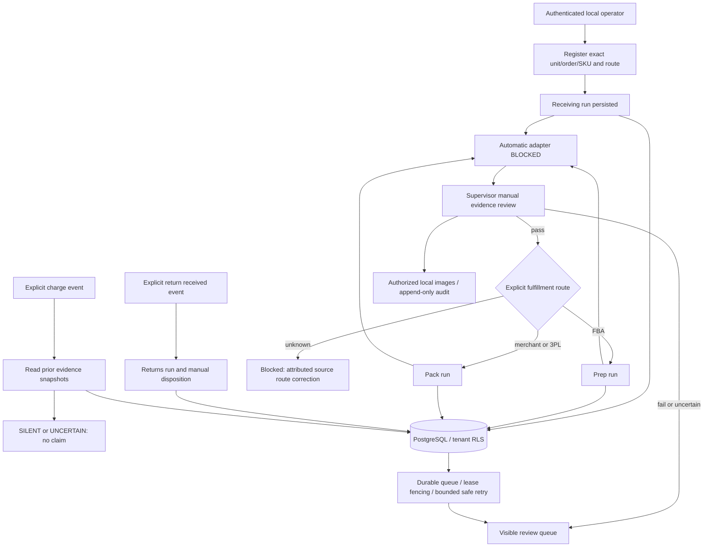

# Integrated commerce backend — local development

Post-competition branch: `post-competition/integrated-local-backend`. This is an original local orchestration implementation informed by the five repositories, not a deployment or an assertion that their visual models work. Read [source comparison](INTEGRATION_COMPARISON.md) first.

## What runs

- Separate FastAPI service at `http://127.0.0.1:8010/docs`; existing Pack UI/service remains separate on 8000.
- One local PostgreSQL 17 database (`pack` on this machine), with existing four Pack tables plus six integrated tables. Alembic revision 002 adds the integration without rewriting historical records.
- Local file storage, hash-checked image metadata, explicit local bearer accounts, tenant RLS, supervisor-only review/control.
- Durable Receiving → explicit FBA Prep OR merchant/3PL Pack routing. Return/charge events open independent branches. A supervisor can record an actual manual inspection, or a clearly labelled fixture review. No automatic visual adapter is enabled.
- Recovery snapshots earlier completed evidence but returns SILENT/UNCERTAIN and `claim_supported=false`. It neither calculates eligibility/amounts nor files claims.



The diagram's boundary represents manual review availability, not recursive automatic execution. Receiving pass queues only one fulfillment branch. Completed Prep/Pack does not requeue Receiving. Workflow state controls scheduling; each run has its own execution state and business verdict.

## Start on this existing computer

Docker's client is installed, but the Linux daemon was unavailable when checked. The existing direct PostgreSQL installation works; do not reset Docker or delete its data. In PowerShell:

```powershell
Set-Location C:\SYDON\cube-03-pack-manager
.local\tools\pgsql\bin\pg_isready.exe -h 127.0.0.1 -p 5432
# Only if it reports no response:
.local\tools\pgsql\bin\pg_ctl.exe -D .local\pgdata -l .local\postgres.log start

# Keep the existing ignored .env. Do not overwrite it with .env.example.
.\.venv\Scripts\python.exe -m alembic upgrade head
.\.venv\Scripts\python.exe -m alembic current
.\.venv\Scripts\python.exe -m backend.integrated.dev init

$env:MODEL_PROVIDER='none'
$env:STORAGE_MODE='local'
$env:WORKER_ENABLED='false' # disables the separate Pack model worker if launched accidentally
.\.venv\Scripts\python.exe -m uvicorn backend.integrated.api:app --host 127.0.0.1 --port 8010
```

In a second PowerShell terminal:

```powershell
Set-Location C:\SYDON\cube-03-pack-manager
$env:MODEL_PROVIDER='none'
$env:STORAGE_MODE='local'
$account = Get-Content .local\integrated-client.json | ConvertFrom-Json
.\.venv\Scripts\python.exe -m backend.integrated.worker --organization $account.organization
```

Run one worker per explicitly configured local organization; no tenant-scanning superuser worker exists. `--once` processes at most one available job and is useful for debugging. Ctrl+C stops foreground processes; queued work remains durable. Do not start duplicate API processes on port 8010. The integrated code imports no model provider and makes no cloud calls even if old credentials remain in `.env`.

On a fresh machine, install PostgreSQL 17 and Python 3.12 through their official distributions, initialize a local cluster and create database `pack`. Create a virtual environment and install `requirements.lock`. Copy `.env.example` only if `.env` does not exist; set local `MIGRATION_DATABASE_URL` for the administrator, `DATABASE_URL` for `pack_app`, and a locally generated `APP_DATABASE_PASSWORD` of at least 20 characters. `python -m backend.bootstrap` creates the non-superuser/NOBYPASSRLS application role and applies migrations. Never run the application as the administrative role. Credentials belong only in local ignored configuration.

## Accounts and fixture lifecycle

`dev init` generates a random local supervisor token and organization. Server account hashes go in `.local/integrated-users.json`; the private demonstration client token goes in `.local/integrated-client.json`. Neither is printed or committed. Existing files are preserved, not rotated. This is development authentication, not production identity management. Additional local users need administrator-created token hashes and explicit organization/operator/role (`viewer`, `operator`, `supervisor`). Tenant headers and operator names in request bodies cannot select identity.

After starting both processes:

```powershell
.\.venv\Scripts\python.exe -m backend.integrated.dev demo
```

The demo uses authenticated HTTP requests, creates a labelled artificial image and unit, performs Receiving and Pack manual fixture reviews, triggers a synthetic charge, and checks that Recovery does not create a claim. It saves `.local/integrated-demo.json`. This is a backend software demonstration, not visual accuracy evaluation. Re-running creates another labelled fixture unit; it never impersonates an official unit or calls a model.

Safe fixture reset:

```powershell
.\.venv\Scripts\python.exe -m backend.integrated.dev archive-fixtures
```

This cancels only workflows explicitly marked `fixture=true` in the generated local tenant. It retains images, original findings and audit history. It does not erase evidence, drop tables, reset the database or modify real workflows. Tests clean up only their own random fixture tenants using the administrative test connection; the app itself cannot delete audit events.

## API

All business endpoints need `Authorization: Bearer <local token>`. All POST endpoints need `Idempotency-Key`; repeat the same key/body after a lost response. Changed body with the same key returns `IDEMPOTENCY_CONFLICT`. Keys are scoped to authenticated operator and operation. Workflow/unit and event uniqueness also prevent duplication across different keys. OpenAPI is available at `/openapi.json`; request types and run outputs are validated.

| Method/path | Purpose / role |
|---|---|
| GET `/health`, `/ready` | Liveness, required DB tables/local storage readiness; explicitly reports inference blocked |
| GET/POST `/v1/catalogue` | Read / operator registration of explicit SKU metadata |
| GET/POST `/v1/units` | Read / operator registration of unit, external order ID, route and lines |
| GET `/v1/units/{unit_id}` | Exact unit and its order lines |
| GET `/v1/orders`, `/v1/orders/{order_id}` | Unit-linked order views; order_id is the supplied external source ID, not a generated Pack record UUID |
| GET/POST `/v1/workflows` | List / start idempotently by exact unit ID |
| GET `/v1/workflows/{id}` | Current state, runs, version, attributable event history |
| POST `/v1/workflows/{id}/events` | `return_received` or `charge_received`, explicit event/unit/order/source |
| POST `/v1/workflows/{id}/images` | Multipart `file`; generated name, format/size/dimension validation, no filename/path trust |
| GET `/v1/images/{id}` | Tenant-authorized private image bytes; never a public file path |
| GET `/v1/runs?state=blocked` | Queue; also supports retryable/review_needed/running/completed/cancelled/queued |
| GET `/v1/runs/{id}` | Versioned execution state, output, error and human review history |
| POST `/v1/runs/{id}/review` | Supervisor; expected version, full manual finding set, image IDs, capture time, reason |
| POST `/v1/runs/{id}/retry` | Supervisor; only eligible pre-dispatch transient work after backoff, max two retries |
| POST `/v1/workflows/{id}/control` | Supervisor; versioned hold/cancel/resume. Cancellation is terminal |
| POST `/v1/workflows/{id}/route` | Supervisor; resolve unknown route once, with source reference/reason; cannot switch branches after execution |
| GET `/v1/records/{run_id}` | Separately validated official 1.1-shaped human evidence for receiving/prep/pack/returns |

Order registration is a local source-registration boundary. It does not silently import teammate defaults or reinterpret a Prep work_order_id as a merchant order. Existing Pack orders/attempts are not automatically merged: their internal IDs require an explicit verified mapping before any future adapter. Catalogue metadata shares Pack's tenant-scoped `records` table. Reference-image registration through this API is blocked pending that adapter; the original Pack catalogue API is unchanged.

Example safe local read without displaying the token:

```powershell
$account = Get-Content .local\integrated-client.json | ConvertFrom-Json
$headers = @{ Authorization = "Bearer $($account.token)" }
Invoke-RestMethod http://127.0.0.1:8010/v1/workflows -Headers $headers
Invoke-RestMethod http://127.0.0.1:8010/v1/runs?state=review_needed -Headers $headers
```

Manual review JSON (replace placeholders with saved local IDs and current version):

```json
{
  "expected_version": 3,
  "reason": "Supervisor inspected the actual receiving capture",
  "captured_at": "<actual UTC capture timestamp>",
  "image_ids": ["<saved image record ID>"],
  "findings": [
    {"check_key":"identity","verdict":"uncertain","detail":"Label cannot be read in this photograph"},
    {"check_key":"quantity","verdict":"uncertain","detail":"Occlusion prevents a supported exact count"},
    {"check_key":"damage","verdict":"uncertain","detail":"Rear surfaces are not visible in the capture"},
    {"check_key":"quality","verdict":"uncertain","detail":"Variant and completeness need physical review"}
  ],
  "source_payload": {"source_record_id":"<original identifier, if present>"}
}
```

Required **internal manual** check sets: Receiving identity/quantity/damage/quality; Prep packaging/labelling/required_views; Pack identity/quantity/contents_visible; Returns identity/completeness/condition plus explicit disposition. These are not a substitute for a complete authoritative channel-rule registry. Manual FAIL takes precedence over uncertainty; uncertainty never approves the next fulfillment stage. Returns cannot restock a failed/uncertain review. Reasons, reviewer and original results are retained. Capture timestamps must be timezone-aware and no older than 24 hours (a conservative local policy, not an organiser rule).

## Actual schema and evidence boundary

`backend/integrated/models.py` plus Alembic 002 define:

| Table | Purpose / constraints |
|---|---|
| `cw_units` | Composite organization/id primary key; id is exact source unit_id; source order/route/lines/raw fields in JSONB |
| `cw_workflows` | One per org/unit, FK to unit; controlled route/state JSONB and monotonic version |
| `cw_runs` | FK to org/workflow, unique org/workflow/manager/trigger; typed versioned output, original findings, reviews, state, lease owner/expiry, retry time/count |
| `cw_events` | Append-only to application role; FK org/workflow; actor, reason, transition and run correlation |
| `cw_requests` | Org/scoped request digest, body digest and committed JSON response for replay |
| `cw_calls` | Unique org/unit, FK org/unit and org/run; committed dispatch-possible reservation and explicit policy name |

All six have creation timestamps and enabled/forced tenant RLS. Existing records/jobs/events/checkpoints remain intact. Images live as `records.kind=integrated_image` metadata with server key/hash/size/source hash/workflow ID; bytes stay in the configured local directory. Application-level image linkage checks accompany RLS. SQL export: [integrated-database-schema.sql](integrated-database-schema.sql).

Internal outputs use `integrated.v1`, not a renamed official schema. Each output states manager/version, exact source unit/order, basis, verdict, findings, image references, upstream evidence IDs and raw source payload. Human/fixture provenance is explicit. Official export uses the supplied Evidence Contract 1.1 shape, original checks plus appended per-check overrides, null confidence, and `decided_by=operator`. Non-UUID source organization IDs are rejected until an explicit official mapping exists. Prep shipment_id is preserved if supplied; omission does not establish a fee join. These exports do not certify authoritative channel compliance, recognition accuracy, or completeness of all organiser endpoints. Recovery has no official operational evidence agent enum and is not falsely exported as one. New evidence photographs are retained in review history; original official images/checks are not rewritten.

## Failure and resumption policy

All saved source findings survive subsequent errors. Only affected fulfillment descendants are blocked; explicit Returns/Recovery events remain independent while the workflow is active.

| Failure | Retry? | State / downstream / recovery action |
|---|---|---|
| Invalid request, wrong unit/order link, foreign evidence | No automatic retry | 422/404; no fabricated run result; correct input and use a new key |
| Unknown route | No guessing | Receiving retained; route resolution requires supervisor and source reference |
| Missing/failed/uncertain/revised Receiving | No automatic fulfillment | Prep/Pack blocked; new attributed review checks current predecessor; previous results retained |
| Visual adapter unavailable | No | BLOCKED; manual inspection possible; never substituted with mock inference |
| Ambiguous/unsupported evidence | No model retry | review_needed; unresolved findings remain uncertain |
| Confirmed discrepancy | No automatic retry | completed technical execution with fail business verdict; fulfillment gate remains closed |
| Provider unavailable/rate limit known before dispatch | Up to 2, 2/4-second backoff | retryable, only after a proven pre-dispatch failure; worker/API can resume |
| Timeout or DB loss after possible dispatch | Never redispatch | reservation survives; lease expiry leads to DISPATCH_OUTCOME_UNKNOWN review |
| Malformed/incomplete model result | No blind repair/retry | Schema rejection/review; no live provider parser enabled in this integration |
| DB outage before transaction commit | Retry same request key | API 503; transaction rolls back; no external call starts before reservation commit |
| DB result write fails | No repeated possible inference | Prior reservation/run retained; recovery marks unknown rather than PASS |
| Storage invalid/unavailable/hash mismatch | Retry storage only after repair | No review approval; generated stable keys let identical upload recover after a lost DB response |
| Duplicate click/job delivery | Replay/no-op | Idempotency + unique event constraints + workflow lock + worker owner fencing |
| Worker crash before dispatch | Bounded safe retry | Expired lease becomes retryable; no model budget consumed |
| Worker crash after reservation | No | Review required; stale owner cannot commit |
| Concurrent/stale review | No automatic overwrite | 409; fetch new version and inspect current evidence |
| Stale capture/missing file/conflicting hash | No | Reject review; source evidence and earlier outputs retained |
| Retry/call budget exhausted | No | Visible reason/review; unit IDs must never be changed to bypass it |
| Tenant/role violation | No | 401/403/404; no authorized cross-tenant record or image access |
| Hold | No new processing | In-flight local finalization defers; resume restarts eligible queue work |
| Cancel | Terminal | Pending runs cancelled, completed outputs retained; no resume from cancellation |
| Recovery insufficient/uncertain evidence | No automated claim | SILENT/UNCERTAIN, claim_supported=false; manual eligibility assessment still outside implemented scope |

The shipped worker has **no inference adapter**. The dispatch ledger and fault tests prepare a safe boundary; they do not prove a provider integration. No final-round call policy was available. Existing Pack's Round 2 budget is unchanged. A future integrated adapter must reconcile that ledger as well, document the applicable organiser policy, and commit reservations before any request. The internal reservation helper's only supported explicit policy is conservative one-per-unit; it is not an enabled feature flag.

## Tests and limitations

```powershell
$env:PACK_POSTGRES_TESTS='1'
.\.venv\Scripts\python.exe -m pytest -q
.\.venv\Scripts\ruff.exe check backend/integrated tests/test_integrated.py
```

See [actual verification](INTEGRATED_VERIFICATION.md). Tests use local PostgreSQL semantics, random isolated tenants and marked images/findings. Failure injection tests do not perform real provider calls. The original research failures remain unchanged; no visual accuracy improvement is claimed.

Not implemented: trustworthy automatic Receiving/Prep/Returns integration, automatic import of legacy Pack attempts, authoritative Prep/condition-rule retrieval, claim eligibility/claim filing, final-round evaluation, an integrated frontend, production account administration, cloud deployment, or a complete multi-manager implementation of all four official capture/feed endpoints. The API/manual workflow is usable locally; it is not a finished five-manager autonomous product.
