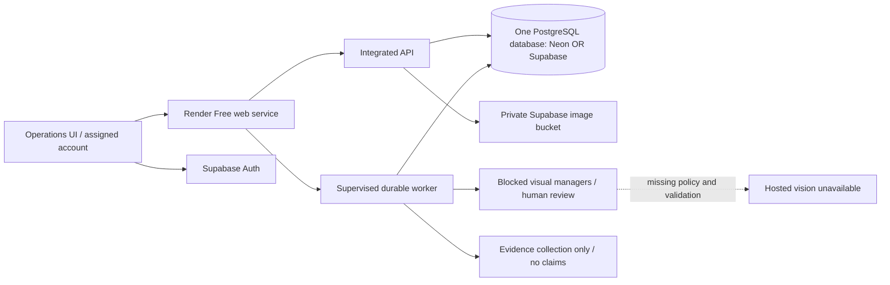

# Round 3 integration readiness — 5 October 2026

This is work in the existing `post-competition/integrated-local-backend` branch. Original Round 2 snapshot `1e503a0` remains an ancestor. No changes are backdated, and this repository has not been verified as the required Pod fork.

## Organiser evidence and unresolved rules

The user supplied the body of a CodeQuesters email dated 4 October. Its body, rather than the Gmail AI summary, states: Pod 7; integration sprint 5–9 October; submit by 9 October 11:59 PM; finale 10 October in Hyderabad; one entry point and orchestrator with clear A2A contracts; show which agents were called and why; withstand agent failures; agree contracts in `/contracts`; use synthetic data only; submit Pod fork/release tag, deployment URL, diagram, runbook and backup demo video.

The email was supplied by the participant, not independently authenticated through Gmail. It describes Round 3 as a separate authorised integration phase; it does not extend Round 2. Its Round 3 repository reference is literally a placeholder, so there is no verified final-round repository URL to fork.

**Missing:** final-round model-call limits (per unit vs manager), permitted tool calls, authoritative shared evidence format, evaluation sample size and independent human labelling procedure. The Round 2 rule reads: “Make **one** call per unit carrying all checks, never one call per check. At prep volumes that is the difference between a 90% gross margin and none.” That rule does not establish a Round 3 exemption or allowance. The dispatch ledger remains unchanged, but no integrated inference dispatch is enabled. Setting a model key does not enable it.

`contracts/` now exposes typed schemas for team review. They are implementation contracts, not a claimed organiser standard. Obtain the actual Pod repository and contract agreement before creating the final release. Do not substitute the Pack fork silently.

## What changed

- Retained one shared PostgreSQL database and migration 002. Separate manager runs remain joined through tenant/unit/workflow IDs.
- Added a real-state processing highlight to the timeline. Only a current `running` run animates; completed/review/blocked states stop it. Stale polling stops the highlight. Polling pauses for dialogs/background tabs and backs off on errors; there is no fake percentage progress.
- Added an opt-in hosted entry point, same-origin frontend/API, Supabase sign-in and private-bucket readiness checks. Public startup rejects development auth, local storage, unsafe database configuration, active inference, demo sessions and non-synthetic mode. Public runtime configuration rejects secret keys and exposes only the public auth key/origin. Ordinary local mode stays unchanged.
- Added a prepared four-manager observation schema, source separation, small catalogue limit, bounded request builder, validation and conservative Pack reconciliation. This is **not a wired or benchmarked provider adapter**: `inspect()` raises `FINAL_ROUND_INFERENCE_POLICY_UNVERIFIED`; the worker never imports its transport. No setting enables automatic visual inspection.
- Added `render.integrated.yaml` and a separate supervised API/worker process entry point. PostgreSQL retains jobs, leases and reservations; the worker is not an in-memory background task. The existing Pack deployment configuration remains unchanged.

## Deployment architecture and cost boundary

Neon is a compatible alternative PostgreSQL host; it does not require separate databases per manager. Use the restricted `pack_app` role for the runtime and a separate owner connection only for migrations. Configure TLS and retain transaction-scoped tenant settings. Hosted migration/role creation on Neon has not been tested on this account. A database alone does not replace the currently implemented authentication and image-storage services.

Official sources checked on 5 October:

- [Render Free](https://render.com/docs/free): free web services sleep after inactivity, have ephemeral local storage and shared monthly instance allowances. This is an intermittent preview, not an always-on worker guarantee. Do not add a paid worker or artificial keep-alive traffic.
- [Supabase billing](https://supabase.com/docs/guides/platform/billing-on-supabase): Free plan project/usage limits apply. The dashboard showed one unrelated AIOps project; it was not modified. No dedicated integration project exists yet.
- [Neon Free update](https://neon.com/blog/neon-free-plan-1-gb-per-project): 2 October update states 1 GB storage per free project. [Connection guidance](https://neon.com/docs/get-started/connect-neon) covers ordinary PostgreSQL connections/pooling. Check account compute/egress allowances before creation. Continuous queue polling can consume compute even with no work; do not promise 30 days of unrestricted operation.
- [Gemini image input](https://ai.google.dev/gemini-api/docs/image-understanding), [structured output](https://ai.google.dev/gemini-api/docs/structured-output), [2.5 Flash](https://ai.google.dev/gemini-api/docs/models/gemini-2.5-flash), [pricing](https://ai.google.dev/gemini-api/docs/pricing): existing Pack adapter is a candidate only. Structured JSON does not establish visual accuracy. No provider selected or benchmarked for the integrated round.

No account upgrades, paid resources or model charges were incurred. ₹0 out of pocket remains the hard limit.

## Safe deployment runbook — not yet executed

1. Confirm the Pod fork URL and choose Neon or Supabase for the single database. Use a dedicated free project; do not repurpose or delete unrelated resources.
2. Configure private credentials locally or in server settings. Never paste secrets in chat. The owner connection is `MIGRATION_DATABASE_URL`; a distinct restricted-role TLS connection is `DATABASE_URL`. Use `APP_DATABASE_PASSWORD` only during documented bootstrap. Apply existing migrations with `python -m backend.bootstrap`, then verify revision 002 and RLS. Do not run production as an owner or bypass-RLS role.
3. Create a private Supabase `evidence` bucket and assigned Auth accounts. Administrator-controlled `app_metadata.pack_organization` and `pack_role` determine access; browser metadata cannot choose tenants. Leave automatic table exposure off. For password sign-in, create/confirm users through the normal Supabase flow; do not expose development account JSON.
4. Set `INTEGRATED_MODE=hosted`, `INTEGRATED_SYNTHETIC_ONLY=true`, `AUTH_MODE=supabase`, `STORAGE_MODE=supabase`, `MODEL_PROVIDER=none`, `DEMO_ENABLED=false`, `WORKER_ENABLED=false` (legacy Pack worker), and the server settings listed in `render.integrated.yaml`. The integrated supervisor starts its own non-inference worker scoped to `PACK_ORGANIZATION`.
5. Build the existing Dockerfile and run `python -m backend.integrated.host_service`. Serve the UI at `/` and API at `/operations-api`. Same-origin hosting avoids a separate CORS configuration; no broad CORS grant is added. Health path is `/operations-api/ready`. No migration-owner credentials belong in the running web service.
6. Only after credentials, dedicated resources and local checks are ready, publish the intended commit to the authorised repository and deploy on Free. Verify sign-in, synthetic upload, authorization, review, reopening, tenant rejection and recovery against the actual URL. No such public verification has happened yet.

## Actual verification

Fresh baseline before changes: 138 PostgreSQL-enabled backend tests; 12 browser tests (24.7 seconds). Subsequent backend run: **160 passed in 8.56 seconds**. New checks reject unsupported/reference evidence, unknown identities, fabricated boxes, unsafe hosting modes, public buckets and accidental secret exposure. All inference tests use synthetic response fixtures without network inference.

Frontend production build passes with bundle-size/third-party annotation warnings. **13 browser tests passed in 24.3 seconds**, covering the real local manual upload/review path plus labelled fixtures for hosted sign-in rejection and true-state/reduced-motion animation. These tests do not constitute public authentication or hosted inference verification.

An isolated API was started, read from the existing database, stopped and started again. All **8 persisted workflow IDs and versions** matched across restart. The existing user API was not stopped; an automatic approval check rejected the original broader restart command. Worker lease/crash/unknown-dispatch behavior is covered by backend integration tests; this check is not a hosted restart claim.

Reference clone HEADs still match remote HEADs: Receiving `b5c4d1a`, Prep `cf6187d`, Returns `01db82b`, Recovery `267b142`. Existing source comparison remains applicable. No teammate repository was changed.

## Vision evaluation — incomplete

No integrated inference requests; no held-out denominator; no identification/count accuracy, false-approval rate, incorrect-stop rate, coverage or latency measurement. No measured inference bill. Synthetic contract tests are not image recognition tests. The eight Pack visual scenarios and blur/glare/occlusion/unknown/empty/variant/conflicting-reference cases still require an organiser-compliant labelled evaluation set and an eligible configured provider.

The seven original RPC development experiments remain reported in `docs/LOCAL_MODEL_RESULTS.md`: five initial failures; one valid JSON response that described 15 references instead of six scene items; one further reference-constrained failure. No expected SKU or reliable counting was established. Prior post-competition research is separately documented in `EVALUATION.md`; none is relabelled as a Round 3 benchmark. Restricted RPC images remain ignored and were not uploaded. The supplied Round 3 email's synthetic-only requirement now governs integration demo data.

## Exact blockers

- Actual Round 3 repository URL, contracts agreement and inference/evaluation rules.
- Dedicated free database, identity and private storage configuration; database choice is under discussion. Render dashboard has a `cube-pack-manager` project with **no active services**.
- Provider selection, configured backend credentials, admissible synthetic evaluation data and independent labels. A saved legacy key does not establish current access, quota or reliable recognition.
- Public deployment and real hosted end-to-end verification. There is no verified public application URL or deployed commit/date.

Recovery remains evidence-only. No final form, release tag, LinkedIn post or submission was published.
