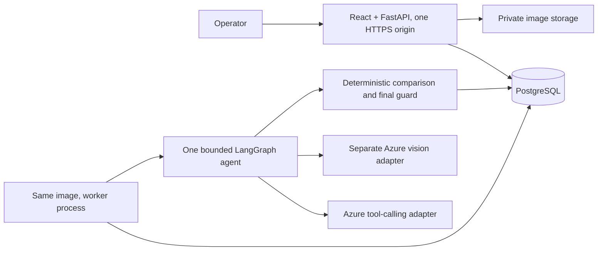

# Proposed architecture — pending starter review

The operator workspace uses a warm off-white canvas (#F6F5F1), navy text (#152737), teal actions (#087F83), restrained borders and textual outcome labels. The real photograph occupies the largest panel. The order and decision appear beside it on desktop and below it on mobile. Empty states show actual next actions, never fabricated metrics.

## First vertical slice

Authenticate and scope every request to organization/client. Snapshot the selected order and catalogue. Validate decoded upload format, pixel count, dimensions and byte limits; normalize orientation and strip unnecessary EXIF. Persist original/transformed hashes and private stable references. An evidence row stays pending until storage succeeds.

Submission validates an idempotency key against a canonical request body and creates a durable PostgreSQL job. A worker atomically leases it. Lease renewal, owner/fencing checks and a uniqueness constraint on the final record prevent stale workers publishing duplicate decisions. External inference may execute twice after crashes; cost accounting must acknowledge that possibility. Retry only transient failures within a cumulative budget.

Graph tools: get_order, get_catalogue_candidates, assess_image_quality, inspect_visible_items, read_visible_label, inspect_crop, compare_order, request_recapture, request_human_review. The controller selects typed allowlisted tools; guard nodes enforce mandatory input/evidence/policy checks independently of the model. OCR/image text is data, never an instruction source.

Initial observation receives no expected quantities. Candidate matching includes plausible alternatives and unknown products. Record distinct visible units, identity evidence and unresolved candidates. Do not manufacture exact localization; mark unvalidated model regions approximate. One primary view counts units; auxiliary views clarify identity without blindly summing counts.

Persist typed state and checkpoints by tenant/session/attempt. A crop cannot reveal hidden pixels. Auxiliary evidence resumes the same unchanged-box attempt; physical corrections require a fresh attempt with no inherited physical observations. Human decisions are append-only events with authenticated actor, reason, timestamp and old/new outcomes, displayed separately from the automated decision.

## Proposed initial budgets, not measured tuning

- 8 controller calls, 12 total tool calls and 3 vision calls per attempt.
- 90 seconds wall-clock execution budget, excluding time paused for human input.
- 2 transient retries, counted inside call/time/token limits.
- 16,000 aggregate model tokens per attempt; reserve output budget before requests and record actual provider usage.
- 1 concurrent inspection per demo session; initial worker concurrency 2.
- 10 MiB upload and 20 megapixel decoded-image limits, adjusted after real model capability checks.

These are project starting choices. Provider output caps, supported tools/images and token accounting need verification against the configured deployment. Budget exhaustion holds sealing with an explicit reason.

## Decision boundary

Execution failure is separate from completed checks and cannot authorize sealing. For completed executions, any positively verified relevant mismatch produces STOP & FIX even when another check is unresolved. Without proven discrepancies, any missing/UNCERTAIN mandatory check produces UNCERTAIN. SEAL requires all mandatory checks PASS, saved evidence, current attempt and supported identities/counts under the documented capture protocol.

Expected check concepts: input_valid, view_sufficient, identity_verified, quantity_matches, no_unexpected_items. Official keys may differ. Unknown counts use lower bounds plus exact_count_known=false. Absence requires coverage support. An explicit empty-box observation differs from an obscured box. No photograph certifies fully hidden contents.

## Persistence and cloud boundaries

Durable entities: tenants/clients/operators; SKU/catalogue/reference versions; orders/lines; inspection sessions/attempts/images; observations/checks/tool events; jobs/checkpoints; overrides; evaluation runs. Tenant predicates apply to every lookup, including evidence access and job execution.

Container Apps web and worker share an immutable image built with bundled React assets. PostgreSQL Flexible Server holds durable state; private Blob Storage holds images. ACR/Blob use managed identity; unavoidable secrets use Key Vault. Run migrations once per release. Keep at least one polling worker alive until tested wake-up scaling exists. Health endpoints do not call inference; provider outages do not make liveness fail. Set replica limits, request quotas and budget alerts; alerts alone do not cap spending.

Bicep, locked dependencies and production code await starter review. No infrastructure has been provisioned or verified.
